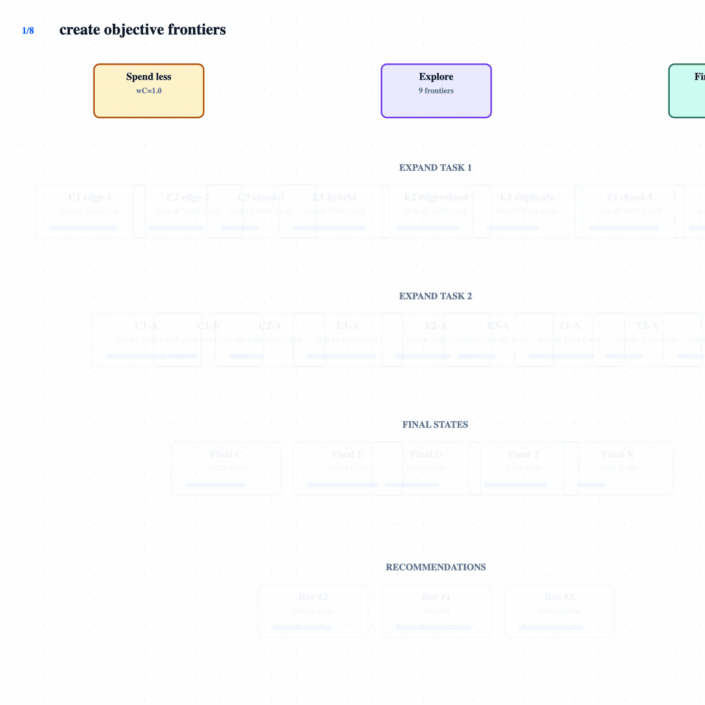

# Scheduler Simulator

Greenfield Docker Compose app for simulating Akoflow-style scientific workflow scheduling.

## Beam Search Recommendation Animation



The animation shows how the scheduler expands candidate schedules, applies beam pruning, ranks final schedules, and selects `Recommendation #1`.

## Run

```bash
docker compose up --build
```

- Frontend: http://localhost:5173
- Backend: http://localhost:8000
- API schema: http://localhost:8000/api/schema

The compose stack is development-only. The backend starts through Delve so you
can attach your IDE debugger to `localhost:2345`.

For VS Code debugging, use **Dev Containers: Reopen in Container** and run the
`Debug Backend (Dev Container)` launch configuration. This keeps Go and Delve
inside Docker, so the host machine does not need a local Go installation.

## Backend Tests Through Docker Compose

```bash
docker compose run --rm backend go test ./...
```

## Montage Experimental Protocol

The backend includes a reproducible batch runner that compares PRISM-CC Time
(`100% time`), PRISM-CC Cost (`100% cost`), and classic HEFT across the six machine
scenarios in `experiments/machine_simulators.csv`.
It imports the selected Montage DAG and runs the paired interference seeds. HEFT
is executed once per scenario because classic HEFT has no co-location and is
therefore independent of the interference selection. The global mean classic HEFT makespan
becomes the fixed deadline, and the global mean HEFT cost becomes the fixed
budget for every execution, without any margin.

Machine prices are read from `experiments/machine_simulators.csv` in USD per
machine-hour. Google Cloud entries use on-demand `us-central1` prices. PlaFRIM
entries intentionally use `0 USD/hour` under the `plafrim_no_direct_charge`
model because they do not generate a cloud bill. Network prices are stored in
USD/GB and converted to USD/MB.

Final schedule cost bills each cloud VM at its full hourly price from its first
boot/start until its last assigned task finishes. This matches the reference
calculation for the original C3D VM. PlaFRIM active intervals remain free.

Run the complete protocol:

```bash
mkdir -p experiments/results/prism-cc-topology-order-exp-01
docker compose run --rm --no-deps \
  -v "${PWD}/experiments/results/prism-cc-topology-order-exp-01:/results" \
  backend \
  go run . \
  -experiment-output /results \
  -experiment-repetitions 30 \
  -experiment-beam-width 120 \
  -experiment-recommendations 100 \
  -experiment-prism-priority topological_order
```

The output directory contains:

- `manifest.json`: fixed seeds, global HEFT mean limits, algorithms, and scenarios;
- `raw_results.csv`: one row per algorithm, scenario, and interference seed.
  Each PRISM-CC row contains `recommendations_json`, with the ranked Time or
  Cost recommendation list, including feasible and infeasible schedules.

For a quick validation, set `-experiment-repetitions 1`. The structural seed is
fixed at 42; interference seeds run from 1 through the requested repetition
count.

### Generate the experiment charts with Jupyter in Docker

The notebooks validate `raw_results.csv` and generate the complete chart set:

```bash
sh experiments/notebooks/run-with-docker.sh
```

For the upward-rank PRISM-CC variant, use
`-experiment-prism-priority upward_rank` and generate its charts with:

```bash
EXPERIMENT_RESULT_DIR=prism-cc-uprank-order-exp-01 \
  sh experiments/notebooks/run-with-docker.sh
```

The script builds the `scheduler-simulator-notebooks` image and executes both
notebooks through `docker run --rm`. No host Python installation is required.

The executed notebooks are stored in `experiments/notebooks`, and the generated
PNGs plus their Portuguese descriptions are written to
`experiments/results/figures`.

## Montage DSS 2.0° — 6,448 tasks

The WfCommons `montage-chameleon-dss-20d-001` instance is available as an
Akoflow-compatible workflow:

- `experiments/wf-montage-chameleon-dss-20d-001.yaml`: 6,448 activities and
  18,924 exact parent/child dependencies;
- `experiments/montage_chameleon_dss_20d_001_runtimes.csv`: observed runtimes
  normalized to the C3D standard 16 reference;
- `experiments/montage_chameleon_dss_20d_001_dependencies.csv`: transferred
  files and exact dependency sizes;
- `experiments/montage_chameleon_dss_20d_001_provenance.json`: source URL,
  checksum, reference machines, and normalization assumptions.

WfCommons records 48 cores and the observed clock frequency for each Chameleon
node, but does not publish FLOPS directly. The importer uses the same peak model
as the existing machine table:

```text
peak GFLOPS = cores × GHz × 8 FLOP/cycle
source speedup vs C3D = source peak GFLOPS / 422.4
ET0 on C3D = observed runtime × source speedup vs C3D
```

This normalization does not change any machine or speedup in
`experiments/machine_simulators.csv`.

Regenerate the artifacts with Python through Docker:

```bash
docker run --rm --user "$(id -u):$(id -g)" \
  -v "${PWD}:/workspace" -w /workspace \
  python:3.12-slim \
  python experiments/scripts/import_wfcommons_montage_dss20.py
```

Select the large workflow in the experimental runner with:

```bash
mkdir -p experiments/results/prism-cc-uprank-montage-dss20-exp-01
set -o pipefail
docker compose run --rm --no-deps \
  -v "${PWD}/experiments/results/prism-cc-uprank-montage-dss20-exp-01:/results" \
  backend \
  go run . \
  -experiment-output /results \
  -experiment-repetitions 30 \
  -experiment-beam-width 120 \
  -experiment-workers 6 \
  -experiment-prism-priority upward_rank \
  -experiment-workflow montage_dss_20d \
  2>&1 | tee experiments/results/prism-cc-uprank-montage-dss20-exp-01/run.log
```

For 6,448 tasks, controlled interference is represented sparsely and evaluated
only for actually co-located tasks, avoiding a quadratic in-memory matrix. The
runner uses four workers and logs each completed environment/seed pair with its
duration, completed percentage, remaining count, and estimated time to finish.

Generate and execute the large-workflow notebooks through Docker after the
runner finishes:

```bash
EXPERIMENT_RESULT_DIR=prism-cc-uprank-montage-dss20-exp-01 \
  sh experiments/notebooks/run-with-docker.sh
```

# akoflow-scheduler-simulator
