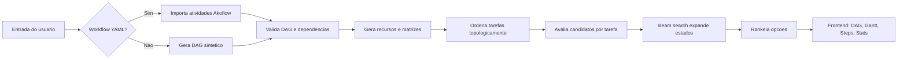
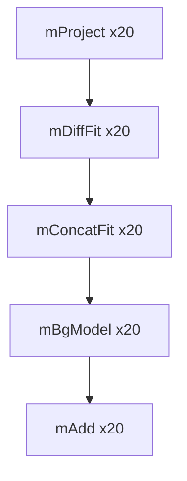
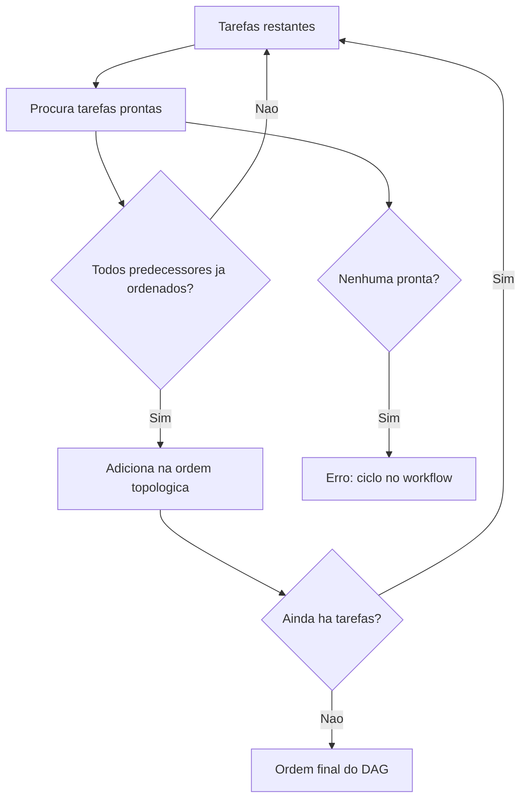
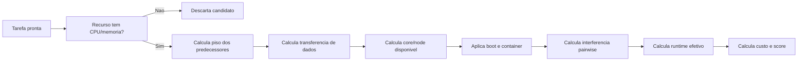
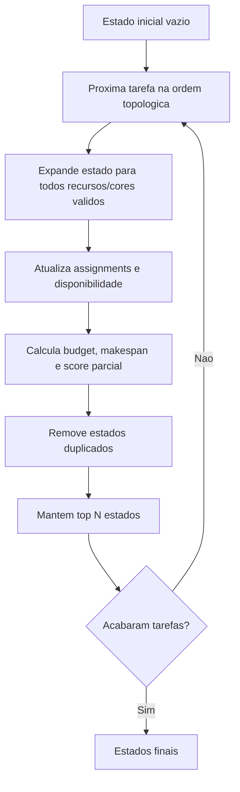
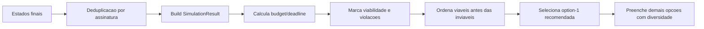
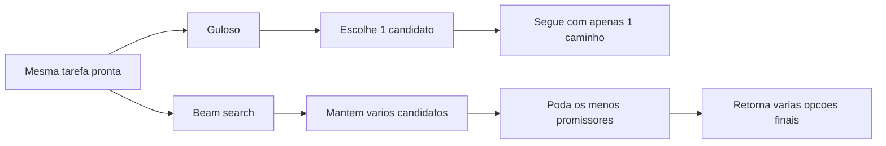

# Visao do algoritmo de escalonamento

Este documento serve como uma visao de Hyperframe para explicar como o simulador monta o DAG do workflow, avalia as dependencias e usa beam search para produzir alternativas de escalonamento.

## Onde esta no codigo

- `backend/workflow.go`: gera um workflow sintetico ou importa um workflow Akoflow em YAML.
- `backend/scheduler.go`: contem o escalonador guloso, a ordenacao topologica, calculo de predecessores, transferencia e interferencia.
- `backend/optimizer.go`: contem a busca por feixe, gerando multiplas opcoes de escalonamento.
- `backend/models.go`: define as estruturas retornadas para a UI, como `Workflow`, `Assignment`, `ScheduleStep` e `ScheduleOption`.
- `frontend/src/components/views/DagView.jsx`: renderiza o DAG resultante.
- `frontend/src/components/views/ScheduleOptionsPanel.jsx`: mostra as opcoes retornadas pelo beam search.

## Visao geral



O simulador sempre transforma o workflow em um DAG. Cada tarefa e um vertice, cada dependencia e uma aresta direcionada, e cada aresta pode carregar um volume de dados (`data_mb`). A ordenacao topologica garante que uma tarefa so seja considerada depois que seus predecessores ja tenham sido alocados.

## DAG

O DAG representa as restricoes de precedencia do workflow:

- `Task`: atividade executavel, com CPU, memoria, imagem, runtime e comando opcional.
- `Dependency`: aresta `source -> target`, com custo de transferencia representado por `data_mb`.
- `PredecessorSets`: mapa auxiliar com os predecessores de cada tarefa.

Exemplo conceitual com `N = 100` atividades do preset Montage. Para caber na visao, cada no abaixo representa um grupo de atividades do mesmo tipo:



No codigo, a funcao `topologicalOrder` em `backend/scheduler.go` percorre o conjunto de tarefas restantes e libera para execucao apenas as tarefas cujos predecessores ja aparecem na ordem final. Se nenhuma tarefa estiver pronta, o workflow possui ciclo e deixa de ser um DAG valido.



## Avaliacao de candidatos

Para cada tarefa liberada pela ordem topologica, o simulador avalia cada combinacao possivel de recurso e core. Um candidato so e valido quando o recurso tem CPU e memoria suficientes para a tarefa.

Cada candidato calcula:

- `predecessorFloor`: menor instante em que a tarefa pode comecar apos predecessores e transferencias.
- `transferDelay`: atraso de rede quando predecessor e tarefa ficam em recursos diferentes.
- `bootOverhead`: tempo de boot em recursos cloud frios ou que ficaram parados.
- `containerOverhead`: tempo adicional de container para a tarefa no recurso.
- `phi_n`: interferencia media causada por tarefas colocalizadas no mesmo recurso.
- `effectiveRuntime`: `ET0 * (1 + phi_n)`.
- `rawCost`: custo incremental de CPU e memoria.
- `score`: combinacao ponderada de tempo e custo pela SLA.



## Beam search

O beam search em `backend/optimizer.go` nao escolhe apenas o melhor candidato imediato. Ele mantem um conjunto limitado de estados parciais, expande esses estados a cada tarefa do DAG e preserva somente os estados mais promissores.

Um `beamState` carrega:

- `Assignments`: tarefas ja alocadas.
- `AssignmentByTask`: acesso rapido ao escalonamento dos predecessores.
- `CoreAvail`: proximo tempo livre de cada core.
- `NodeHasBooted`, `NodeReadyTime`, `NodeLastActive`: estado de boot e ociosidade dos recursos.
- `StopIntervals`: intervalos de parada/boot em cloud.
- `SchedulerSteps`: trilha de decisao para a UI.
- `PartialBudgetUsed`, `PartialMakespan`, `PartialScore`: metricas acumuladas; o score parcial poda a busca sem usar os limites finais de budget/deadline.



### Largura do feixe

A largura do feixe e controlada pela SLA com `beam_width`:

- `option_count` pode ir de 1 a 1000 e define quantas opcoes finais retornar.
- `beam_width` pode ir de 120 a 10000, com padrao 2000, e define quantos estados parciais a busca tenta preservar a cada tarefa.
- A busca usa 11 frentes objetivas, de `0.0 tempo / 1.0 custo` ate `1.0 tempo / 0.0 custo`, em passos de `0.1`; o `beam_width` total e dividido entre essas frentes.

Valores altos de `beam_width` aumentam o espaco explorado e o tempo de processamento. Valores altos de `option_count` aumentam o tamanho do payload, porque cada opcao retorna um `SimulationResult` completo.

O `beam` nao usa `budget_limit` nem `deadline_limit` para decidir quais estados continuam vivos. Esses limites sao aplicados na saida final para marcar viabilidade, calcular violacoes e ordenar as opcoes recomendadas.

### Score parcial

Em cada expansao, o estado recebe um score acumulado:

```text
partialScore =
  score anterior
  + score do candidato
  + pequeno desempate pelo rank local do candidato
```

Estados com menor `PartialScore` sao preferidos. Em empate, o algoritmo prefere menor `PartialMakespan` e depois menor `PartialBudgetUsed`.

## Saida do otimizador

Depois que todos os estados finais sao construidos, `buildOptions` converte cada estado em uma opcao completa de escalonamento:

- monta um `SimulationResult`;
- calcula budget usado e makespan;
- marca violacao de budget e deadline;
- calcula `WeightedScore`;
- ordena opcoes viaveis antes das inviaveis;
- recomenda a melhor opcao por viabilidade/violacao/desempenho;
- usa diversidade para preencher as opcoes seguintes sem tirar a melhor opcao da primeira posicao.



## Diferenca entre escalonador guloso e beam search

O escalonador guloso (`scheduleWorkflow`) escolhe o melhor candidato local para cada tarefa e segue em frente. Ele e simples e rapido, mas uma escolha boa agora pode bloquear uma combinacao melhor depois.

O beam search (`optimizeSchedule`) mantem varias possibilidades vivas. Isso permite comparar caminhos diferentes de alocacao no DAG, respeitando precedencia, custo, disponibilidade dos cores, overhead de boot, transferencia de dados e interferencia.



## Como ler na interface

- **DAG**: mostra as tarefas e suas dependencias.
- **Steps**: mostra, para cada tarefa, os candidatos avaliados, ranking e escolha.
- **Gantt**: mostra inicio, fim, recurso/core e paralelismo.
- **Pairwise**: mostra interferencias entre tarefas colocalizadas.
- **Machines**: mostra distribuicao de tarefas por recurso.
- **Variables**: mostra as variaveis calculadas para tempo, custo, interferencia e scheduler.

Essa estrutura ajuda a enxergar o algoritmo em tres camadas: o DAG define o que pode executar, a avaliacao de candidatos define onde cada tarefa poderia executar, e o beam search decide quais caminhos completos valem continuar ate virar uma opcao final.

## Animacao explicativa

Para fechar a visao, existe uma animacao local em [beam-search-animation.html](beam-search-animation.html). Ela usa um exemplo Montage com `N = 100` atividades e mostra o algoritmo em cinco quadros:

- o workflow como DAG;
- a liberacao das primeiras tarefas pela ordem topologica;
- a expansao de candidatos por recurso/core;
- a poda do beam sem aplicar limites finais de budget/deadline;
- a conversao dos estados finais em opcoes recomendadas.

Abra o arquivo no navegador ou incorpore no Hyperframe como um frame HTML. A animacao nao usa dependencias externas.
