# Gráficos do protocolo experimental — HEFT com colocação

Este é o resultado piloto preservado. A referência usada nesta rodada foi a
implementação HEFT com colocação: atividades podiam executar simultaneamente
em cores diferentes da mesma máquina e, nesse caso, ativar interferência.

Budget global (média HEFT): `0.5036366833333333`. Deadline global (média HEFT): `170.72955000000016` segundos. Cada combinação possui 30 sementes pareadas.

## Makespan por ambiente e algoritmo

Boxplots das 30 sementes. A linha vermelha é o deadline global, calculado como a média de todas as execuções HEFT. Caixas mais baixas indicam conclusão mais rápida.

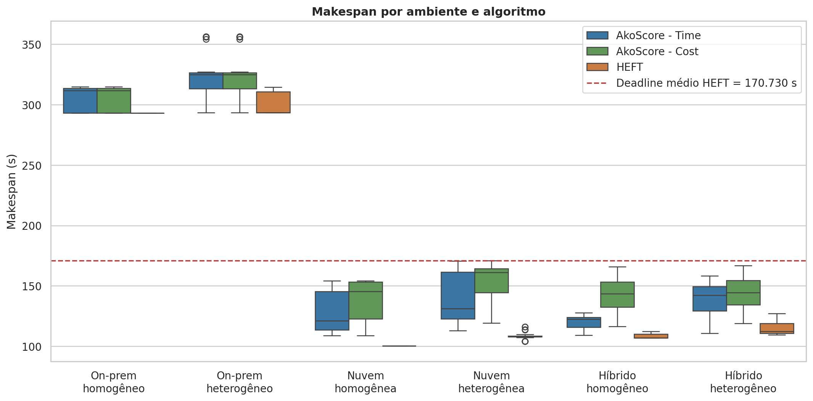

## Custo por ambiente e algoritmo

Compara o custo total das 30 execuções. A linha vermelha é o budget global, calculado como a média de todos os custos HEFT. Cenários on-premise aparecem com custo financeiro zero.

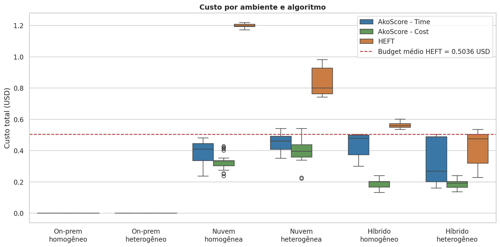

## Factibilidade conjunta

Percentual de execuções que respeitaram simultaneamente budget e deadline. É a leitura mais direta de cumprimento do SLA.

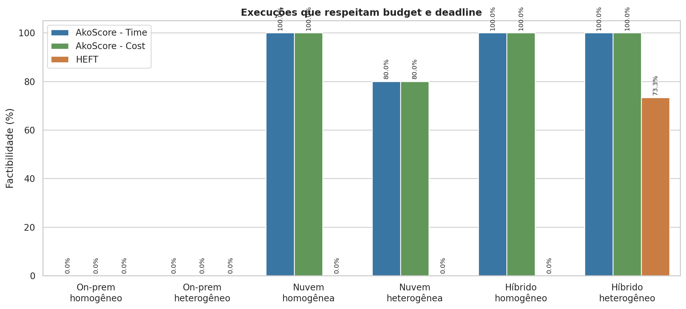

## Trade-off custo × makespan

Cada ponto é uma execução. As linhas vermelhas representam o budget e o deadline globais definidos pelas médias de todas as execuções HEFT.

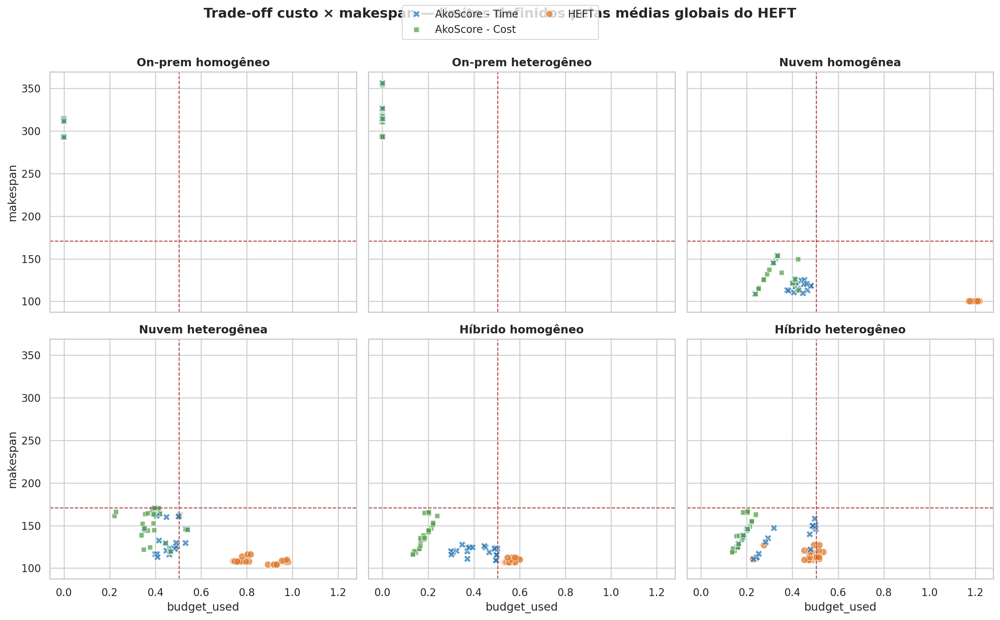

## Ganho pareado das variantes Beam sobre HEFT

Diferenças calculadas semente a semente para Beam-Time e Beam-Cost. Valores positivos favorecem a variante Beam; negativos favorecem HEFT. O painel esquerdo mede makespan e o direito mede custo.

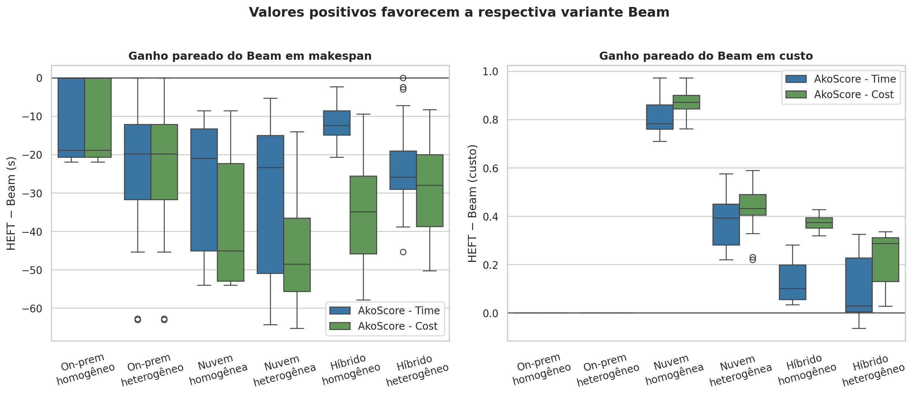

## Interferência × makespan

Relaciona o tempo total adicionado pela interferência ao makespan, com tendência linear por algoritmo. Indica quanto o atraso de interferência chega ao caminho crítico.

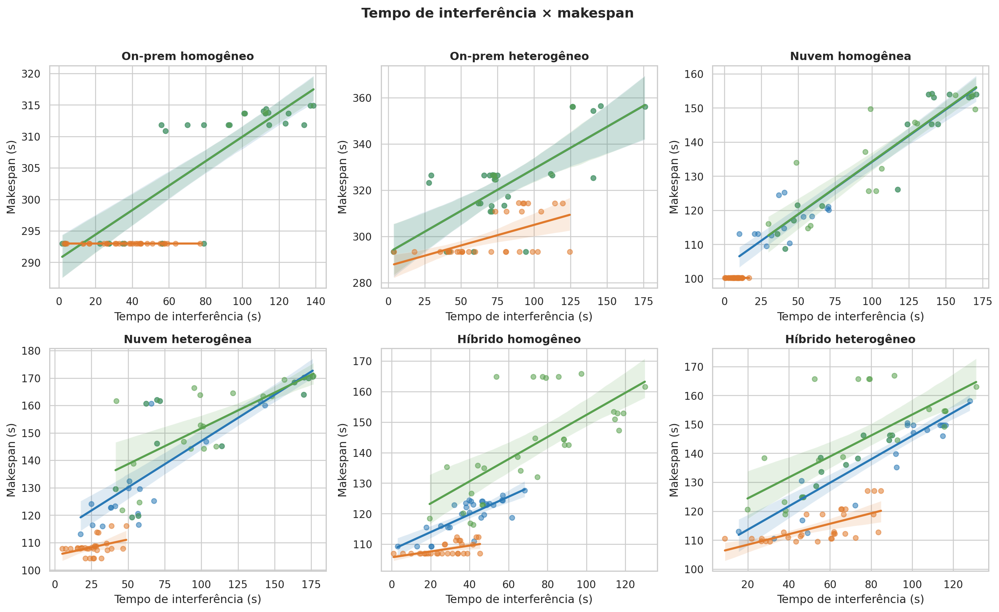

## Pares interferentes × makespan

Relaciona quantos pares realmente se sobrepuseram na mesma máquina ao makespan. Distingue atividades selecionadas de interferências efetivamente ativadas.

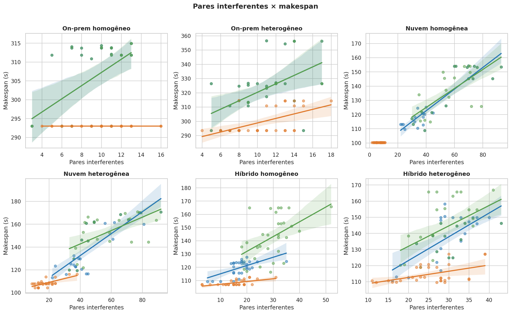

## Distribuição do tempo de interferência

Boxplots do overhead total provocado pela interferência. Permite comparar a capacidade de cada escalonador de evitar sobreposições prejudiciais.

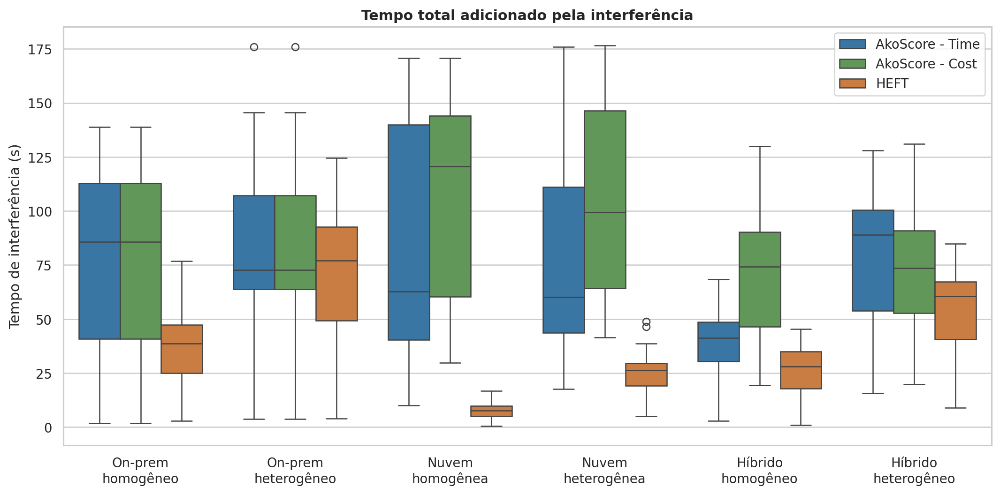

## Heatmap de utilização

Utilização média de cada máquina considerando seus cores e o makespan. Células escuras indicam maior ocupação relativa.

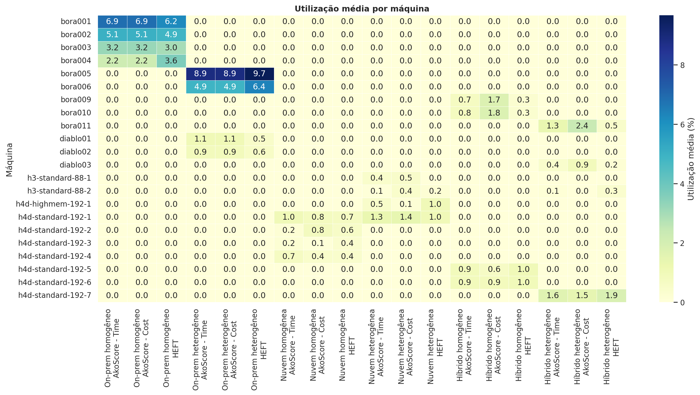

## Distribuição das atividades

Barras empilhadas com a parcela média das 58 atividades destinada às famílias Bora, Diablo, H3 e H4D.

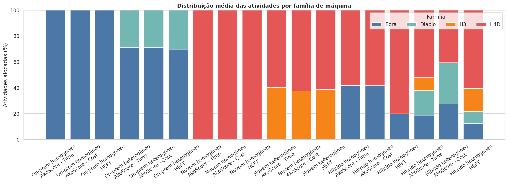

## Tempo dos algoritmos

Custo computacional do escalonamento em escala logarítmica. Evidencia a diferença de tempo entre a busca Beam e o HEFT.

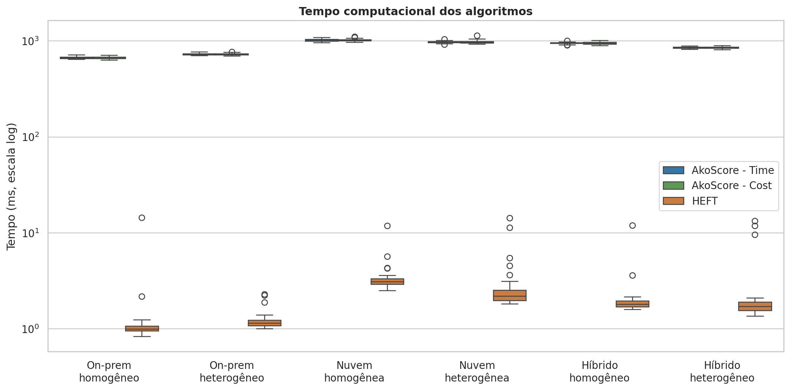

## Estabilidade entre sementes

Acompanha o makespan nas 30 seleções pareadas de atividades interferentes. Oscilações mostram sensibilidade à composição da interferência.

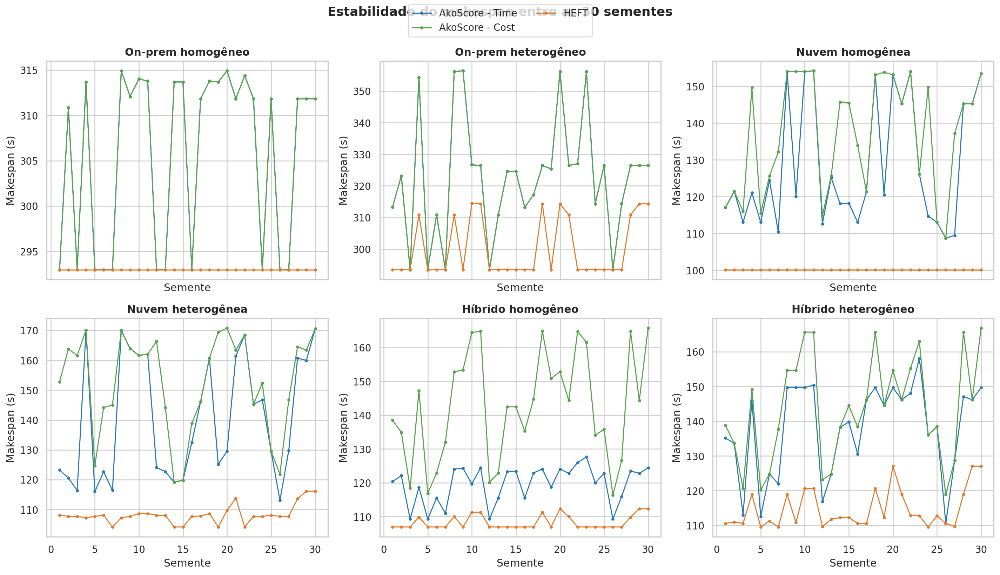
