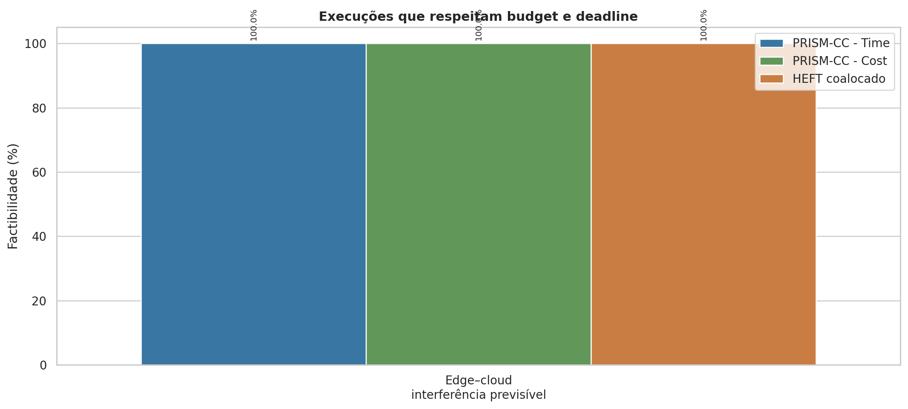
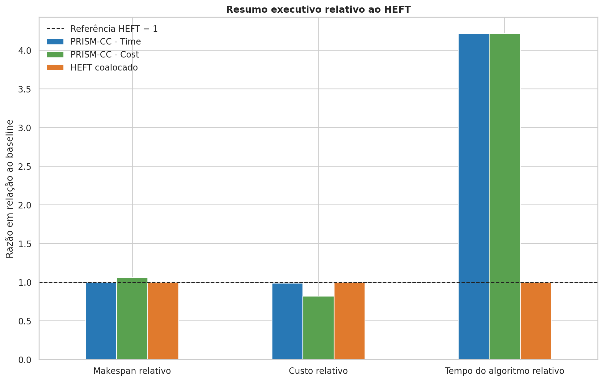

# PRISM × HEFT coalocado — interferência previsível

Montage 6.448, 30 sementes e SLA definido pelo HEFT clássico com margem de 1,2×.

- 
- 
- 
- 
- 
- 
- 
- 
- 
- 
- 
- 
- 
- 
- 
- 
- 
- 
- 
- 
- 
- 
- 
- 
- 
- 
