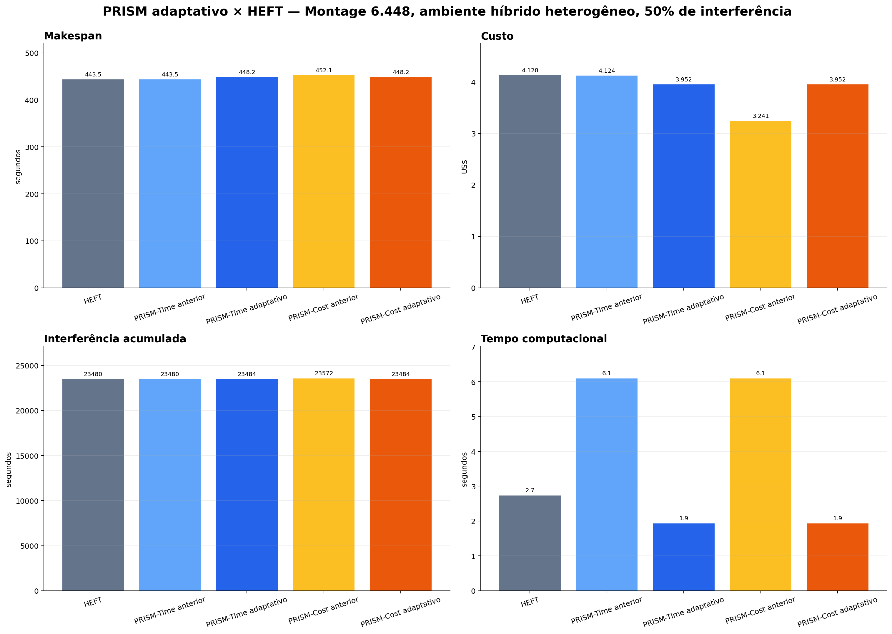

# PRISM adaptativo × HEFT — interferência de 50%

Comparação do HEFT com as versões anterior e adaptativa do PRISM no Montage com 6.448 atividades, em ambiente híbrido heterogêneo e interferência de 50%.

## Gráficos

- [Makespan](figures/01-comparacao-makespan.png)
- [Custo](figures/02-comparacao-custo.png)
- [Interferência acumulada](figures/03-comparacao-interferencia.png)
- [Relação custo × makespan](figures/04-fronteira-custo-makespan.png)
- [Tempo computacional](figures/05-tempo-computacional.png)
