# Gráficos do protocolo experimental

Prioridade das tarefas do PRISM-CC: **upward rank**.

Budget global (média HEFT): `1.0114725000000009`. Deadline global (média HEFT): `344.1261666666664` segundos. Cada combinação possui 30 sementes pareadas.

## Makespan por ambiente e algoritmo

Boxplots das 30 sementes do PRISM-CC. A linha vermelha é o deadline global, calculado como a média das execuções HEFT clássico. Como o HEFT clássico não possui co-alocação nem interferência, seu resultado é determinístico e aparece como uma linha em cada ambiente.

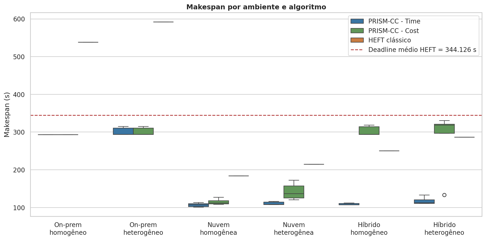

## Custo por ambiente e algoritmo

Compara o custo total das 30 execuções. A linha vermelha é o budget global, calculado como a média de todos os custos HEFT. Cenários on-premise aparecem com custo financeiro zero.

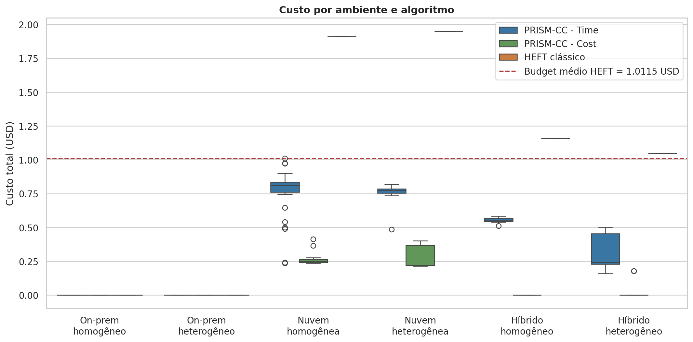

## Factibilidade conjunta

Percentual de execuções que respeitaram simultaneamente budget e deadline. É a leitura mais direta de cumprimento do SLA.

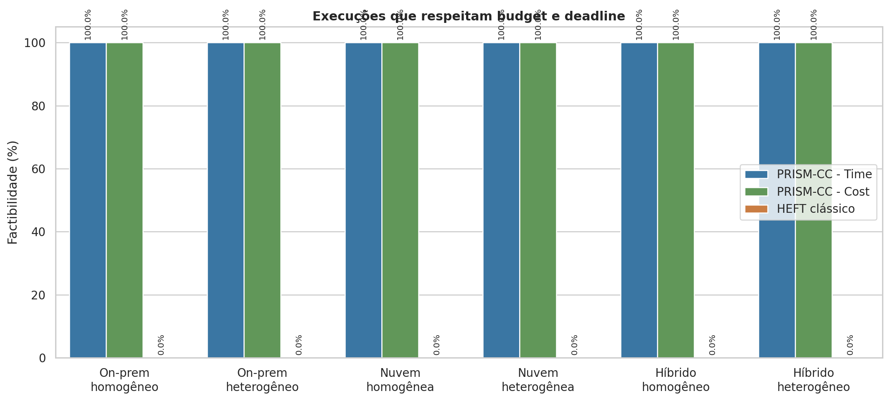

## Trade-off custo × makespan

Cada ponto é uma execução. As linhas vermelhas representam o budget e o deadline globais definidos pelas médias de todas as execuções HEFT.

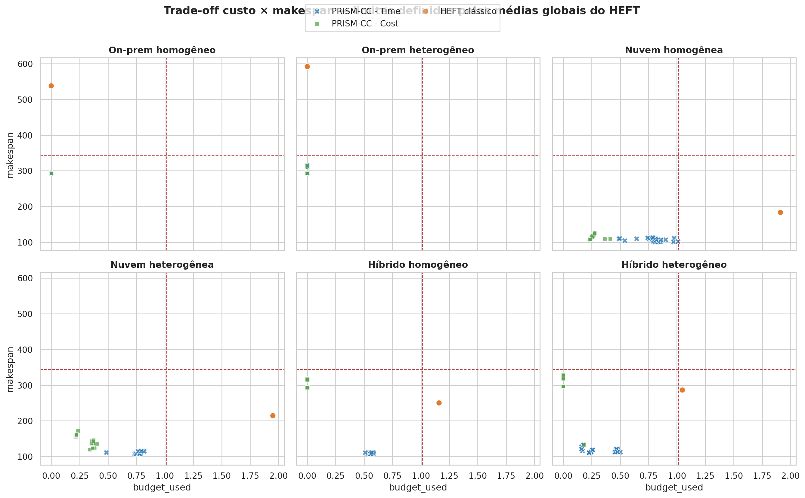

## Ganho pareado das variantes PRISM-CC sobre HEFT

Diferenças calculadas semente a semente para PRISM-CC Time e PRISM-CC Cost. Valores positivos favorecem a variante PRISM-CC; negativos favorecem o HEFT clássico. O painel esquerdo mede makespan e o direito mede custo.

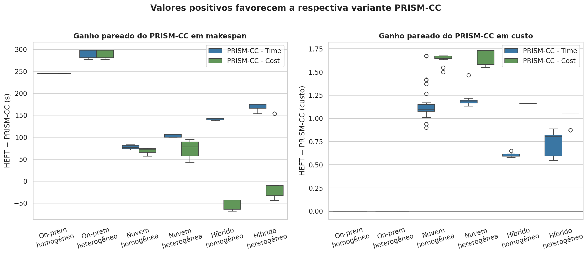

## Interferência × makespan

Relaciona o tempo total adicionado pela interferência ao makespan, com tendência linear por algoritmo. Indica quanto o atraso de interferência chega ao caminho crítico.

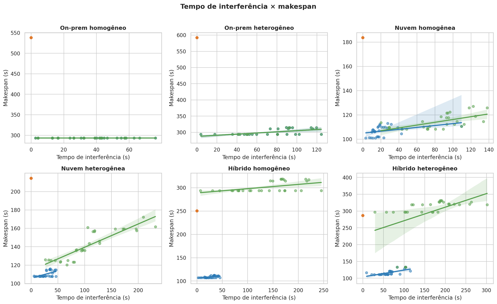

## Pares interferentes × makespan

Relaciona quantos pares realmente se sobrepuseram na mesma máquina ao makespan. Distingue atividades selecionadas de interferências efetivamente ativadas.

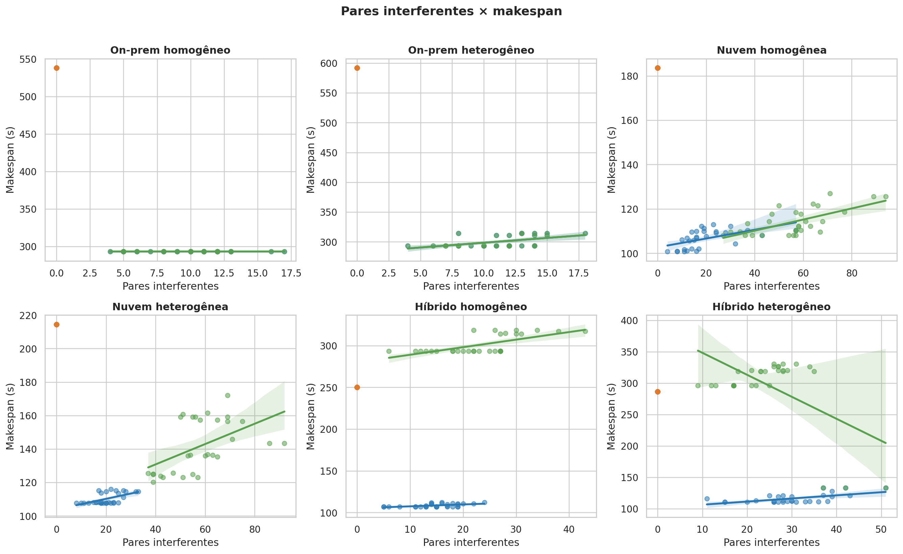

## Distribuição do tempo de interferência

Boxplots do overhead total provocado pela interferência. Permite comparar a capacidade de cada escalonador de evitar sobreposições prejudiciais.

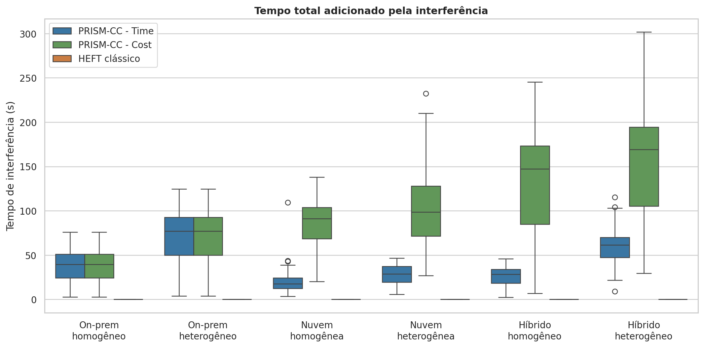

## Heatmap de utilização

Utilização média de cada máquina considerando seus cores e o makespan. Células escuras indicam maior ocupação relativa.

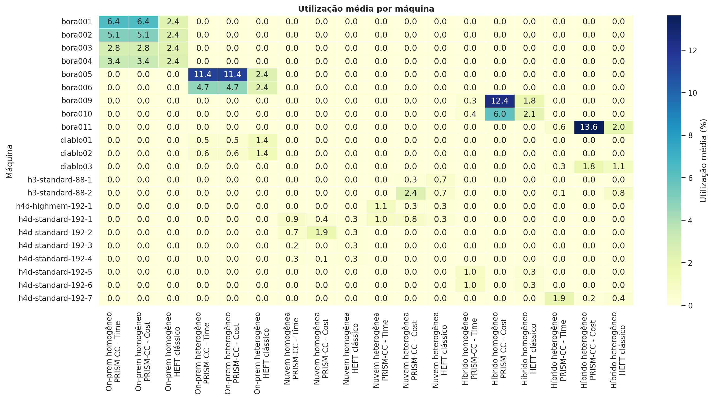

## Distribuição das atividades

Barras empilhadas com a parcela média das 58 atividades destinada às famílias Bora, Diablo, H3 e H4D.

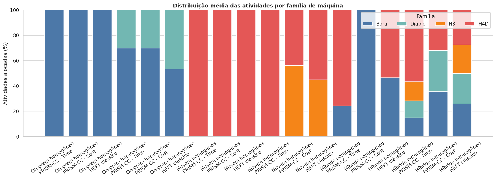

## Tempo dos algoritmos

Custo computacional do escalonamento em escala logarítmica. Evidencia a diferença de tempo entre a busca Beam e o HEFT.

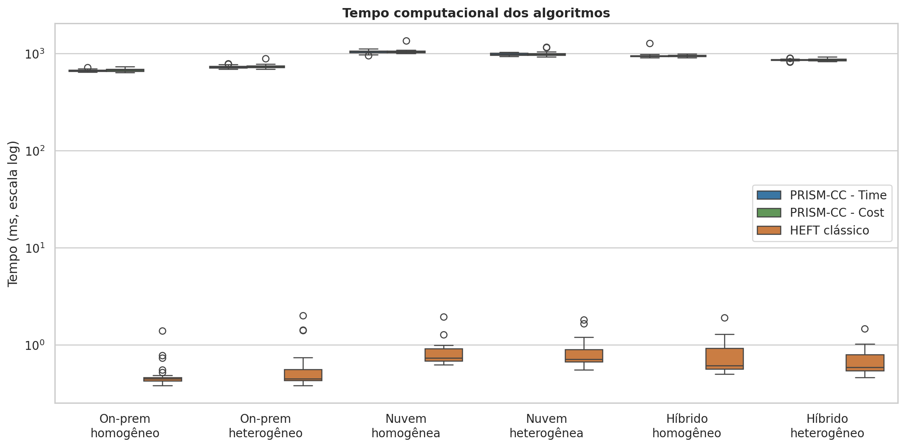

## Estabilidade entre sementes

Acompanha o makespan nas 30 seleções pareadas de atividades interferentes. Oscilações mostram sensibilidade à composição da interferência.

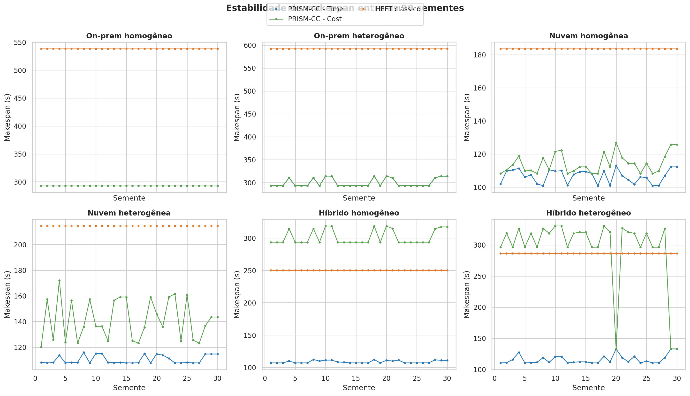

## Comparação Topology × UpRank

Compara diretamente as duas políticas de prioridade do PRISM-CC, mantendo máquinas, sementes, interferência, Beam Search, budget e deadline constantes. O painel superior mostra makespan e o inferior mostra custo.

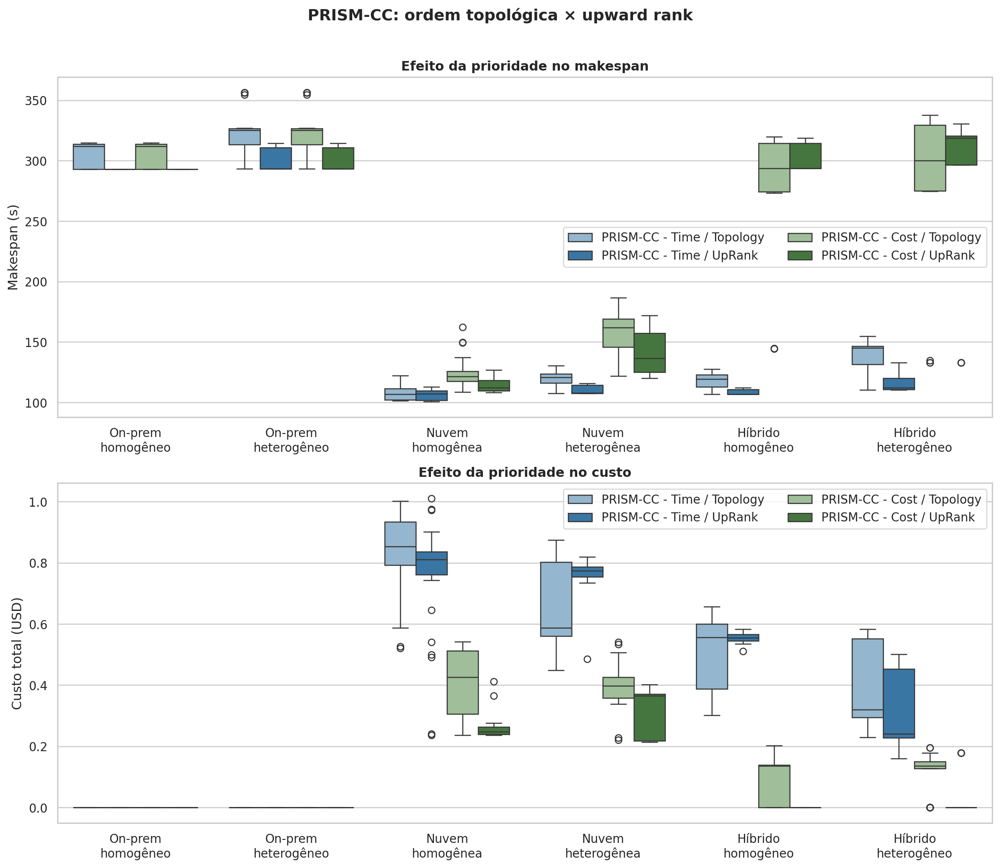
