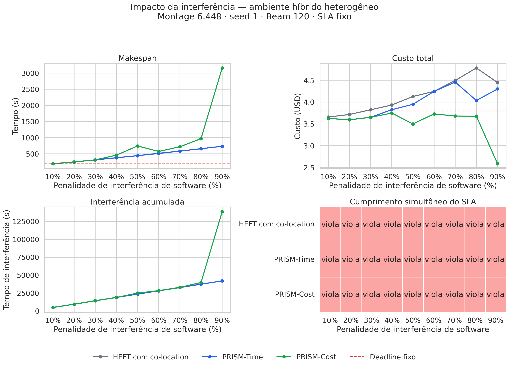

# Impacto da interferência de software

Experimento no ambiente híbrido heterogêneo com Montage 6.448, seed 1,
PRISM Upward Rank, HEFT com co-location e Beam 120.

A penalidade por tarefa interferente sobreposta varia de 10% a 90%.
O conjunto de atividades interferentes permanece pareado e constante.
O SLA foi calibrado sem interferência e mantido fixo em todas as execuções:

- Deadline: 187.842000 s
- Budget: US$ 3.798521

