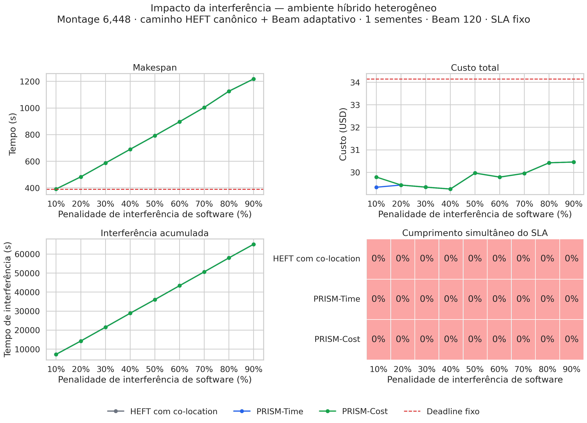

# Impacto da interferência de software

Experimento no ambiente híbrido heterogêneo com Montage 6,448,
1 sementes pareadas,
PRISM com **caminho HEFT canônico + Beam adaptativo**, HEFT com co-location e Beam 120.

A penalidade por tarefa interferente sobreposta varia de 10% a 90%.
O conjunto de atividades interferentes permanece pareado e constante.
O SLA foi calibrado sem interferência e mantido fixo em todas as execuções:

- Deadline: 390.132000 s
- Budget: US$ 34.148266

## Gráficos individuais

- [Makespan por interferência](figures/makespan-por-interferencia.png)
- [Custo por interferência](figures/custo-por-interferencia.png)
- [Interferência acumulada](figures/interferencia-acumulada.png)
- [Factibilidade por interferência](figures/factibilidade-por-interferencia.png)
